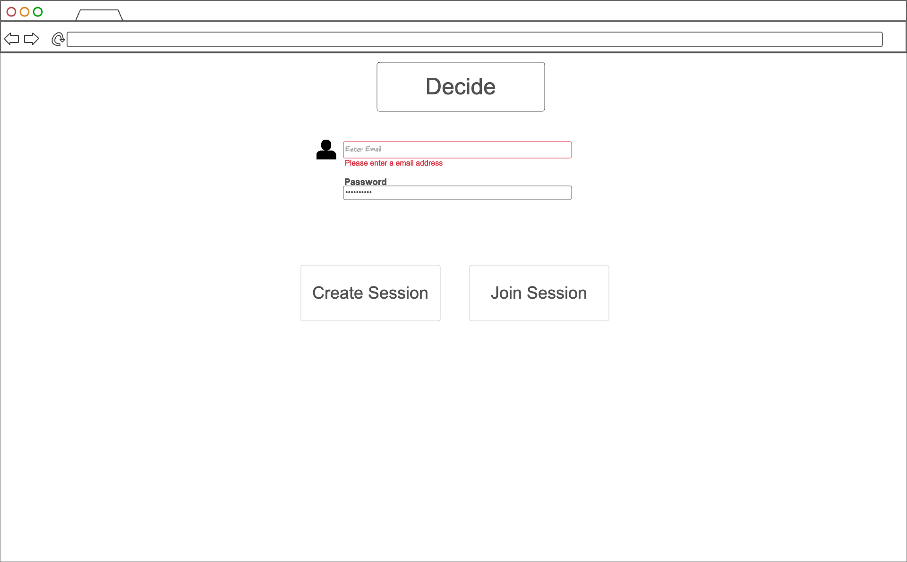
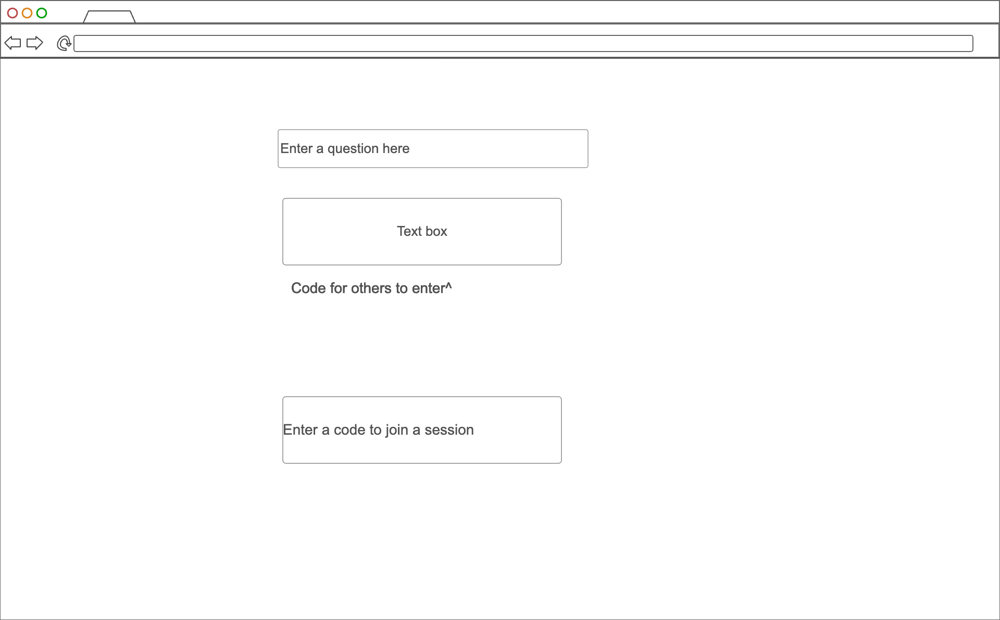
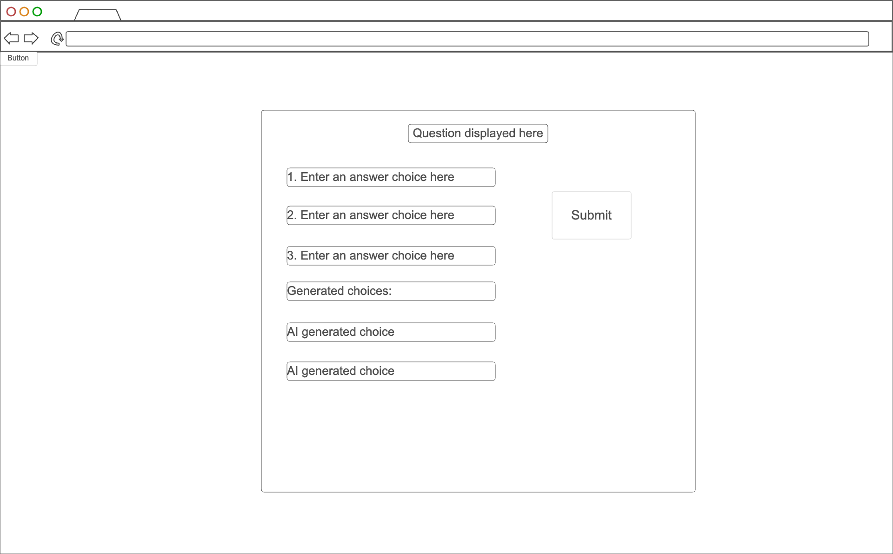
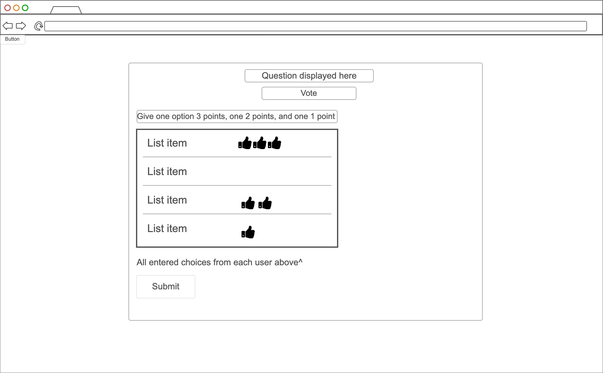
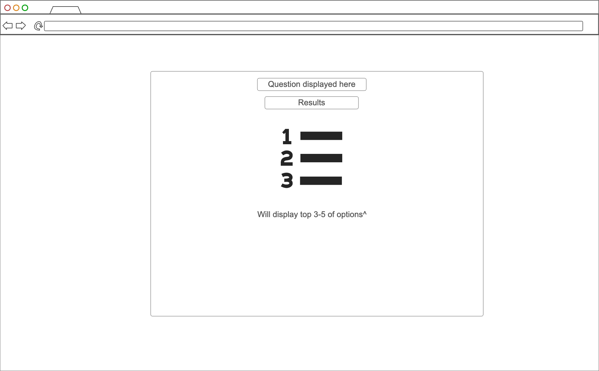
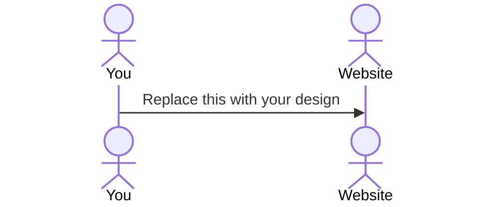

s# Decision Engine

[My Notes](notes.md)

A collaborative decision-making engine where users can log in, enter what they are struggling to decide on, propose options, receive AI-generated suggestions, and vote on their preferences of all of the options each individual user entered. The top options are then displayed in real-time on each user's screen, helping groups quickly come to a decision after seeing the best choices.

## 🚀 Specification Deliverable

For this deliverable I did the following. I checked the box `[x]` and added a description for things I completed.

- [x] Proper use of Markdown
- [x] A concise and compelling elevator pitch
- [x] Description of key features
- [x] Description of how you will use each technology
- [ ] One or more rough sketches of your application. Images must be embedded in this file using Markdown image references.

### Elevator pitch

Have you ever struggled to make a group decision? Whether it's deciding what to eat, what movie to watch, or what to do that night, this Decision Engine simplifies the process. Users input their own ideas on their own, receive AI-generated suggestions for options they never even thought of, and collaboratively vote on a combined list using an interactive point system to reach a conclusion. 

### Design

Sequence Diagram
-User logs in.
-User creates or joins a decision-making session.
-Users input options; backend combines lists and broadcasts them to all devices.
-AI (OpenAI API) suggests additional options.
-Users allocate points (3, 2, 1) to their top choices.
-Results are tallied and displayed in real time.

### Key features

- Secure login and session management
- Ability to enter the question to decide
- Option input and AI-generated suggestions
- Real-time synchronization of options across devices
- Voting system with weighted points (3, 2, 1)
- Totals from all users displayed in realtime
- Results and user entered lists stored

### Technologies

I am going to use the required technologies in the following ways.

- **HTML** - Uses correct HTML structure for application. Five HTML pages. A page for login, a page for creating a session or joining a session, entering options, voting, and for results.
- **CSS** - Responsive, visually appealing design that adapts to various screen sizes.
- **React** - Provides login, display for entering ideas, displays AI generated ideas, applying votes, display total users votes, and use of React for navigation.
- **Service** - REST API endpoints could be used for login, option submission, voting, and result retrieval. OpenAI API will be used to generate options related to what users entered as their option ideas.
- **DB/Login** - Database will store user sessions, decision topics, entered lists, and result retrieval. It will login users and keep sessions between authorized users. Authentication ensures only authorized users participate. Potentially may create a login system using JSON Web Tokens (JWT)
- **WebSocket** - Enables real-time updates for synchronization and vote tallying.

## 🚀 AWS deliverable

For this deliverable I did the following. I checked the box `[x]` and added a description for things I completed.

- [ ] **Server deployed and accessible with custom domain name** - [My server link](https://yourdomainnamehere.click).

## 🚀 HTML deliverable

For this deliverable I did the following. I checked the box `[x]` and added a description for things I completed.

- [ ] **HTML pages** - I did not complete this part of the deliverable.
- [ ] **Proper HTML element usage** - I did not complete this part of the deliverable.
- [ ] **Links** - I did not complete this part of the deliverable.
- [ ] **Text** - I did not complete this part of the deliverable.
- [ ] **3rd party API placeholder** - I did not complete this part of the deliverable.
- [ ] **Images** - I did not complete this part of the deliverable.
- [ ] **Login placeholder** - I did not complete this part of the deliverable.
- [ ] **DB data placeholder** - I did not complete this part of the deliverable.
- [ ] **WebSocket placeholder** - I did not complete this part of the deliverable.

## 🚀 CSS deliverable

For this deliverable I did the following. I checked the box `[x]` and added a description for things I completed.

- [ ] **Header, footer, and main content body** - I did not complete this part of the deliverable.
- [ ] **Navigation elements** - I did not complete this part of the deliverable.
- [ ] **Responsive to window resizing** - I did not complete this part of the deliverable.
- [ ] **Application elements** - I did not complete this part of the deliverable.
- [ ] **Application text content** - I did not complete this part of the deliverable.
- [ ] **Application images** - I did not complete this part of the deliverable.

## 🚀 React part 1: Routing deliverable

For this deliverable I did the following. I checked the box `[x]` and added a description for things I completed.

- [ ] **Bundled using Vite** - I did not complete this part of the deliverable.
- [ ] **Components** - I did not complete this part of the deliverable.
- [ ] **Router** - Routing between login and voting components.

## 🚀 React part 2: Reactivity

For this deliverable I did the following. I checked the box `[x]` and added a description for things I completed.

- [ ] **All functionality implemented or mocked out** - I did not complete this part of the deliverable.
- [ ] **Hooks** - I did not complete this part of the deliverable.

## 🚀 Service deliverable

For this deliverable I did the following. I checked the box `[x]` and added a description for things I completed.

- [ ] **Node.js/Express HTTP service** - I did not complete this part of the deliverable.
- [ ] **Static middleware for frontend** - I did not complete this part of the deliverable.
- [ ] **Calls to third party endpoints** - I did not complete this part of the deliverable.
- [ ] **Backend service endpoints** - I did not complete this part of the deliverable.
- [ ] **Frontend calls service endpoints** - I did not complete this part of the deliverable.

## 🚀 DB/Login deliverable

For this deliverable I did the following. I checked the box `[x]` and added a description for things I completed.

- [ ] **User registration** - I did not complete this part of the deliverable.
- [ ] **User login and logout** - I did not complete this part of the deliverable.
- [ ] **Stores data in MongoDB** - I did not complete this part of the deliverable.
- [ ] **Stores credentials in MongoDB** - I did not complete this part of the deliverable.
- [ ] **Restricts functionality based on authentication** - I did not complete this part of the deliverable.

## 🚀 WebSocket deliverable

For this deliverable I did the following. I checked the box `[x]` and added a description for things I completed.

- [ ] **Backend listens for WebSocket connection** - I did not complete this part of the deliverable.
- [ ] **Frontend makes WebSocket connection** - I did not complete this part of the deliverable.
- [ ] **Data sent over WebSocket connection** - I did not complete this part of the deliverable.
- [ ] **WebSocket data displayed** - I did not complete this part of the deliverable.
- [ ] **Application is fully functional** - I did not complete this part of the deliverable.
